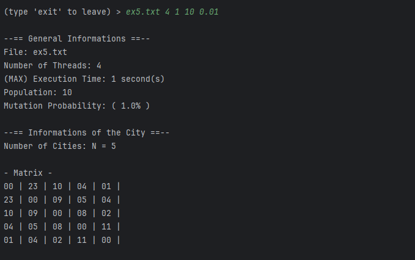
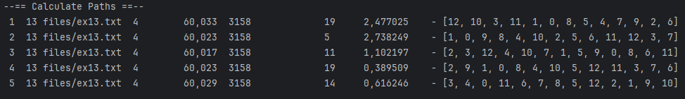
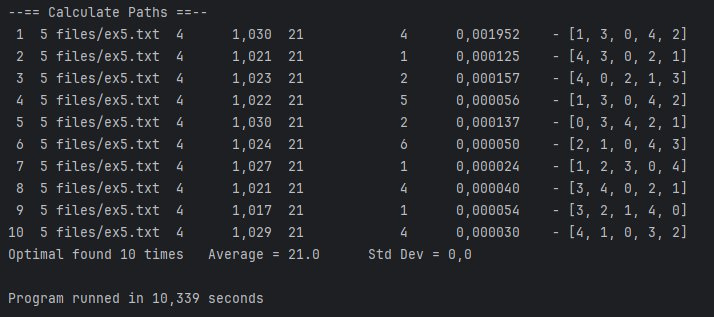
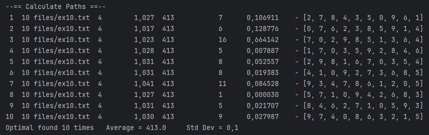

# TSP - Traveling Salesman Problem Solver (Java)

## Overview 🔍

This Java-based project is part of an experiment to evaluate the parallel performance between Java and Python programming languages, using an algorithm that aims to solve the **Traveling Salesman Problem (TSP)** with a multithreaded parallelized approach and the Partially Mapped Crossover (PMX) technique. The TSP is a classic optimization problem where the goal is to find the most efficient route that visits a set of cities exactly once and returns to the starting city.

---

## Project details 🚀

This project was based of TSP-Java from Miguel Rôlo. The main goal of this fork is to adapt the original project to be able to generate reports for a performance analysis between parallel capabilities in different programming languages. Comparing the performance of the Java version with the Python version.

---

## How to run? 🏃

To run the project, you need to have Java SDK 21 installed on your machine. You can download it [here](https://www.oracle.com/java/technologies/downloads/#java21).
After that, you can run the main class ```Main.java```.
To generate the reports [jakarta.json](https://mvnrepository.com/artifact/jakarta.json/jakarta.json-api/2.1.3) dependencies are needed

---

## Features ✅

### 1 - Multithreading

The solution utilizes Java multithreading to parallelly explore different paths in the solution space, improving the overall efficiency of the algorithm. This enables the program to explore multiple potential solutions simultaneously, leading to faster convergence towards the optimal solution.

### 2 - PMX Crossover

The genetic algorithm incorporates the PMX crossover technique to create diverse offspring. PMX ensures that the child solutions inherit parts of their parents' paths, preserving the integrity of the route while introducing variability. This enhances the algorithm's ability to explore and converge towards optimal solutions.

### 3 - Mutation Probability

The genetic algorithm incorporates a mutation mechanism with adjustable probability. Mutation introduces diversity in the population by randomly altering some solutions, preventing premature convergence to suboptimal solutions. Users can fine-tune the mutation probability to strike a balance between exploration and exploitation.

### 4 - Population

The genetic algorithm maintains a population of potential solutions, evolving them over generations. A diverse population helps the algorithm explore a broader solution space. Users can configure the size of the population based on the characteristics of the TSP instance, allowing for flexibility in handling different problem complexities.

### 5 - Convergence Analysis

The program performs multiple runs to evaluate the convergence behavior of the algorithm. By executing the algorithm multiple times, users can observe the consistency of the results and analyze the convergence trends. This feature provides insights into the algorithm's performance and robustness across different runs.

### 6 - Report Generation

The program generates detailed reports summarizing the results of the TSP solver. These reports include information about the best solution found, the convergence behavior, and the execution time. Users can analyze these reports to assess the algorithm's performance and compare different configurations or problem instances.

---

## Showcase 🔭

|                                   |                                     |
|:---------------------------------:|:-----------------------------------:|
|  |  |
|  |  |

---

## How it works? 🛠️

### Parameters

To execute the TSP solver you need to fill the following parameters:

|           Param           | Example  |                       Description                        |
|:-------------------------:|:--------:|:--------------------------------------------------------:| 
|      ```fileName```       | ex13.txt | Already gets from "files" folder, just put the file name |
|    ```threadsNumber```    |    4     |         Number of Threads to execute the program         |
| ```numberOfExecutions```  |    30    |                  Number of convergences                  |
|  ```populationNumber```   |   100    |                     Population size                      |
| ```mutationProbability``` |   0.01   |                      from 0.01 to 1                      |

Final Result:
```Java
>  <fileName> <threadsNumber> <numberOfExecutions> <populationNumber> <mutationProbability>
```
Example
```Java
>  ex13.txt 4 30 100 0.01 
```

---

### Results
|   File    | Best distance |
|:---------:|:-------------:|
|    ex5    |      21       |
|    ex6    |      23       |
|    ex7    |      105      |
|    ex8    |      244      |
|    ex9    |     1472      |
|   ex10    |      413      |
|   sp11    |      133      |
|   uk12    |     1733      |
|   ex13    |     3158      |
|  burma14  |     3323      |
|   lau15   |      291      |
| ulysses16 |     6859      |
|   gr17    |     2085      |
| ulysses22 |     7013      |
|   gr24    |     1272      |
|   fri26   |      937      |
| dantzig42 |      699      |
|   att48   |     33523     |

---

### Reports
The reports are generated in the ```reports``` folder, as a ```.txt```  and ```.json``` files.

---

## Author 🤝

> This project was based on [Miguel Rolo's TSP project](https://github.com/MiguelRolo/TSP) and adapted by me.

---

## License 🪪

> **(Apache License, Version 2.0)** You're **free to use** this content and codes in any project, personal or commercial. 
>
> There's no need to ask permission before using theses. Giving attribution is not required, but appreciated.